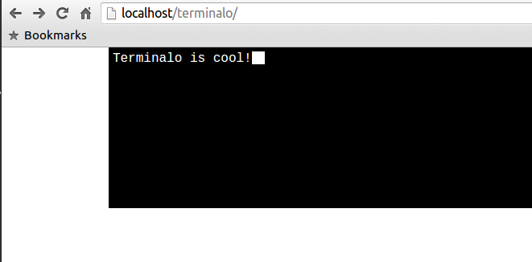

# terminalo
html text area transformed to look like terminal

Bunch of javascript functions along with some css transforms html text-area into terminal like nerdy looking 'TerminalArea'.
Made it as a feature that I required to use in other website.
Uses:
  1. Can be used as a cool looking comment box.
  2. Along with some predefined commands given, form submission.(actually I did this in other project)
  3. others.. (a lot more, can't write all)
  
  

-----------
Caution:
-----------
It's a work in progress. Features:
 * [x] give interface new look.
 * [ ] can send request to some api.
 * [ ] fix some bugs
